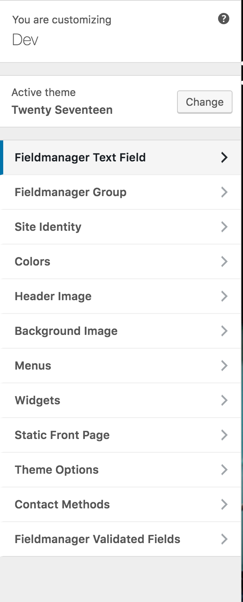
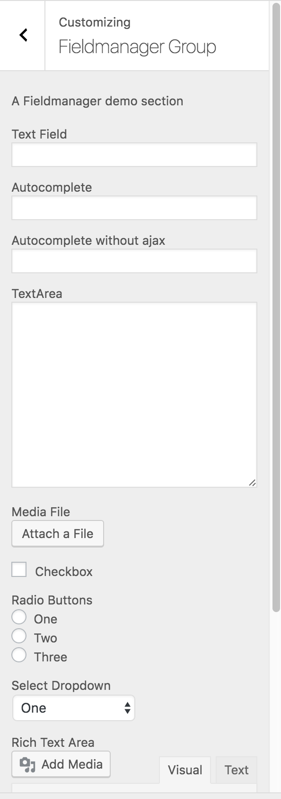
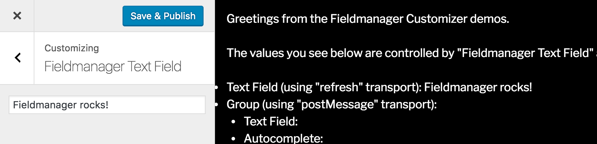

# Fieldmanager Beta: Customize #
**Contributors:** [dlh](https://profiles.wordpress.org/dlh), [alleyinteractive](https://profiles.wordpress.org/alleyinteractive)  
**Requires at least:** 4.4  
**Tested up to:** 4.6.1  
**Stable tag:** 0.1.0  
**License:** GPLv2 or later  
**License URI:** http://www.gnu.org/licenses/gpl-2.0.html  

A Fieldmanager Beta plugin for the Customize Context.

## Description ##

This is the proposed Customize context for Fieldmanager. You can install the plugin alongside a stable Fieldmanager release to help test and refine the context.

The official Pull Request for the Customize context, plus tests, is [on GitHub](https://github.com/alleyinteractive/wordpress-fieldmanager/pull/399).

## Installation ##

1. Install and activate [Fieldmanager](https://github.com/alleyinteractive/wordpress-fieldmanager).
2. Install and activate this plugin.
3. Use the `fm_beta_customize` context action to instantiate your fields. For example:

		add_action( 'fm_beta_customize', function () {
			$fm = new Fieldmanager_TextField( 'My Field', [ 'name' => 'foo' ] );
			fm_beta_customize_add_to_customizer( 'My Section', $fm );
		} );

For more code examples, browse `php/demos/class-fieldmanager-beta-customize-demo.php`. To see the demos in action in the Customizer, place `add_action( 'fm_beta_customize', 'fm_beta_customize_demo' )` in your plugin or theme.

## Screenshots ##

### 1. Fieldmanager mingling with other sections in the Customizer. ###

### 2. Fieldmanager fields in the Customizer. ###

### 3. Detail from the demos bundled with this plugin. ###

## Changelog ##

### 0.1.1 ###
* Rename the Customize context action to 'fm_beta_customize' for improved future compatibility with Fieldmanager.

### 0.1.0 ###
* Initial release.

## Fieldmanager-specific quirks ##

* RichTextAreas: These are supported via the `Fieldmanager_Beta_Customize_RichTextArea` class included with this plugin. Use a `Fieldmanager_Beta_Customize_RichTextArea` in place of `Fieldmanager_RichTextArea` when you want to use TinyMCE in the Customizer.
* Scripts and styles: Some Fieldmanager JavaScript and CSS files require changes for the Customize context. This plugin includes the updated versions of those files and filters Fieldmanager to return them.
